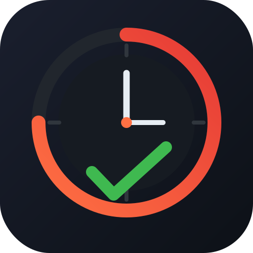

<p>
  
</p>

# orivo

[](https://github.com/mt-shihab26/orivo/blob/main/LICENSE)
[](https://github.com/mt-shihab26/orivo/actions/workflows/build.yml)
[](https://github.com/mt-shihab26/orivo/actions/workflows/test.yml)
[](https://crates.io/crates/orivo)
[](https://docs.rs/orivo)

A terminal-based (TUI) Todos + Pomodoro timer written in [Rust](https://www.rust-lang.org)

## Installation

### Linux Or macOS

```sh
curl -fsSL https://github.com/mt-shihab26/orivo/releases/latest/download/install.sh | bash
```

The script will:

- **Install sqlite3** — the only system dependency, detected and installed automatically for your distro
- **Install the binary** — fetches the latest release for your OS and architecture. places `orivo` in `~/.local/bin`
- **Install the desktop entry** *(Linux only)* — registers orivo in your launcher. Defaults to kitty; pass `-s -- --terminal alacritty` to use alacritty instead
- **Install the icon** *(Linux only)* — installs the app icon to the hicolor theme for the desktop entry

> Running the same command again will **upgrade** to the latest version, or do nothing if already up to date.

### Windows

> **Requires sqlite3** — install it and ensure it's on your `PATH` before running.

Download the Windows release binary from the latest GitHub Release:

- `orivo-vX.Y.Z-windows-x86_64.exe`
- `orivo-vX.Y.Z-windows-aarch64.exe`


```powershell
mv orivo-vX.Y.Z-windows-x86_64.exe orivo.exe
```

Then place it somewhere on your `PATH`, or keep it in a directory of your choice and run it directly:

```powershell
.\orivo.exe
```

### Cargo (any OS, builds from source)

> **Requires sqlite3** — install it for your OS and ensure it's on your `PATH` before building.

```sh
cargo install orivo
```

## Configuration

Config file location: `~/.config/orivo/config.toml`

```toml
# Orivo configuration


show_fps = false # show the FPS counter in the TUI header on startup


# Database connection — Orivo uses Turso (libSQL/SQLite) for syncing todos across machines.
[db]
url   = "libsql://your-db-name.turso.io"   # libSQL URL from: turso db show orivo --url
token = "your-auth-token"                  # auth token from: turso db tokens create orivo
# Get your Turso credentials:
#   turso auth login
#   turso db create orivo
#   turso db show orivo --url
#   turso db tokens create orivo


# Pomodoro timer settings — controls session lengths and when long breaks are triggered.
[timer]
show_millis         = false   # show milliseconds in the timer display
work_duration       = 25      # work session length in minutes         (min: 1, max: 120)
break_duration      = 5       # short break length in minutes          (min: 1, max: 60)
long_break_duration = 15      # long break length in minutes           (min: 1, max: 60)
long_break_interval = 4       # work sessions before a long break      (min: 1, max: 10)
daily_session_goal  = 16      # target work sessions to complete today (min: 1, max: 24)

```

### Root Options

- `show_fps` → show the FPS counter when the TUI starts. You can still toggle it at runtime with `Ctrl+F`.

### Database (`[db]`)

Orivo uses [Turso](https://turso.tech) as its database — a libSQL-compatible SQLite database built on top of SQLite. You need a `url` and `token` to connect.

```sh
turso auth login
turso db create orivo
turso db show orivo --url      # → paste as url
turso db tokens create orivo   # → paste as token
```

### Timer (`[timer]`)

The [Pomodoro technique](https://en.wikipedia.org/wiki/Pomodoro_Technique) breaks work into focused sessions separated by breaks:

- **Work session** → focused work period (default: 25 min)
- **Short break** → rest between sessions (default: 5 min)
- **Long break** → rest after completing a full cycle (default: 15 min)

A full cycle = `work_duration` × `long_break_interval` work sessions. After that many sessions, a long break is triggered instead of a short one.

```
work → break → work → break → work → break → work → LONG BREAK  (cycle of 4)
```

**Daily session goal** (`daily_session_goal`) sets how many work sessions you aim to complete each day. Progress is shown as a session tracker in the timer tab. Once the goal is reached the tracker fills completely.

- Default: `16` sessions
- Range: `1` – `24` sessions
